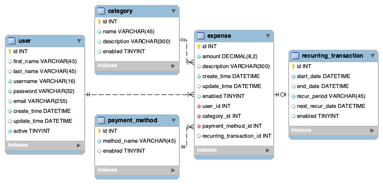

# **Expense Tracker**

<!--  -->

  

## **Overview**

| **Homework - Skill Distillery** |
|:-------------------------------:|
|       Week 12 - Backend               |   
| Week 13 - Frontend (JavaScript/AJAX)  |
|   Week 14 - Frontend (Angular)        |    

The Expense Tracker Project is a RESTful API designed to manage expenses. Built with **MySQL**, **Spring Data JPA**, **Spring Boot**, and **Angular** the application allows for a user to perform CRUD operations on expenses and organize them by categories and payment methods. The purpose of this project is to create a backend API that provides endpoints for interacting with expenses data. The current version replaces the JavaScript/AJAX front end with an Angular front-ned for improved functionality and user experience.

### **MySQL Workbench - Schema**
<!-- #### **First weekend**
  -->
<!-- #### **Current Schema:**  -->
<!-- - (added the recurring_transaction table to be able to handle costs that haven't been incurred yet, and potential future income.) -->

### **Rest Endpoints**
- **Test with Postman:**
  - https://www.postman.com/downloads/
- **AWS Deployment:**  
  - Linked Here: http://justdentondevelops.com/

| HTTP Verb | URI                                         | Request Body                             | Response Body                                  | Response Codes  |
|-----------|---------------------------------------------|------------------------------------------|------------------------------------------------|-----------------|
| GET       | `/api/expenses`                             |                                          | List of all expenses                           | 200             |
| GET       | `/api/expenses/{expenseId}`                 |                                          | Representation of a specific expense           | 200, 404        |
| GET       | `/api/expenses/categories/{categoryId}`     |                                          | List of expenses for a specific category       | 200, 404        |
| GET       | `/api/expenses/payments/{paymentMethodId}`  |                                          | List of expenses for a specific payment method | 200, 404        |
| POST      | `/api/expenses`                             | Representation of a new _expense_        | Representation of the created expense          | 201, 400        |
| PUT       | `/api/expenses/{expenseId}`                 | Representation of an updated _expense_   | Representation of the updated expense          | 200, 404, 400   |
| DELETE    | `/api/expenses/{expenseId}`                 |                                          |                                                | 204, 404, 400   |

### **Methodologies Used:**
- **RESTful Design**
  - Created an API with clear endpoints that represent resources.
  - Followed best practices for resource naming conventions to create readable and predictable URIs.
- **Test-Driven Development (TDD)**
  - Used JUnit to verify entity mappings.

## **Technologies Used**
- **Backend:**
  - Java
  - Spring Data JPA
  - Spring Boot
  - MySQL, MySQL Workbench
  - AWS
  - git, GitHub
  - Postman
- **Frontend:**
  - Angular
    - (replaced JavaScript/AJAX from previous version)
  - Typescript
  - HTML/CSS

## **Lessons Learned** 
- **Understanding MySQL Workbench**
  - Gained experience with designing and visualizing database schemas.
- **Understanding APIs:** 
  - Gained experience with how to structure APIs to serve as a bridge between backend systems and (future) frontend applications.
  - Tested, using Postman to verify all CRUD operations and potential errors.
- **DOM Manipulation:** Learned how to manipulate the DOM using JavaScript to display data fetched from the backend API.
- **Understanding Angular:**
  - Gained experience with buidling a frontend using Angulat, including components, services, and data binding.

## **Resources**
- https://github.com/SkillDistillery/SD44/blob/main/rest/EventTracker/README.md
- https://www.restapitutorial.com/introduction/resourcenaming
- https://www.restapitutorial.com/httpstatuscodes
- https://angular.dev/guide/templates/pipes
- https://angular.dev/guide/components

